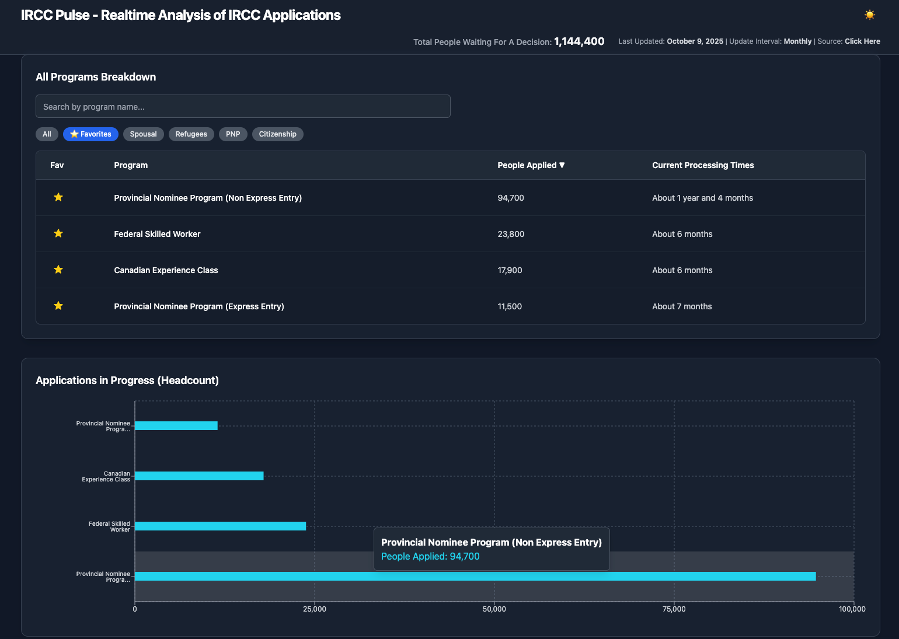
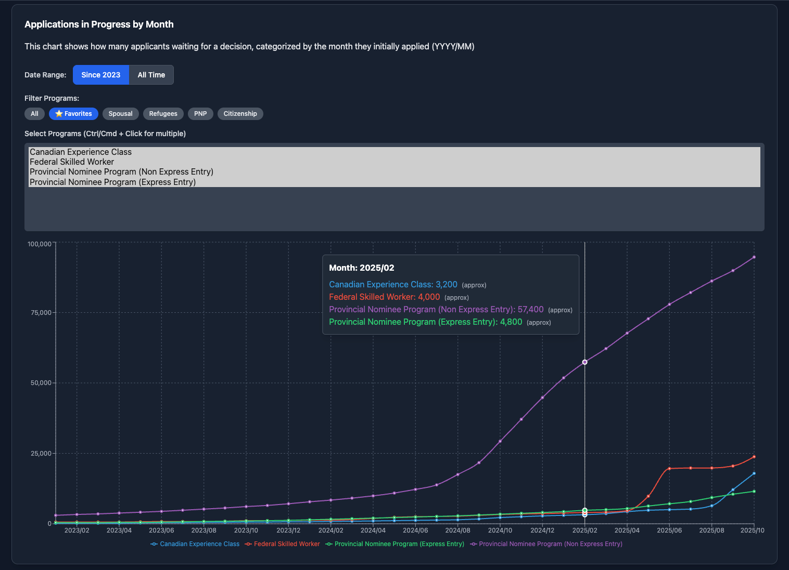
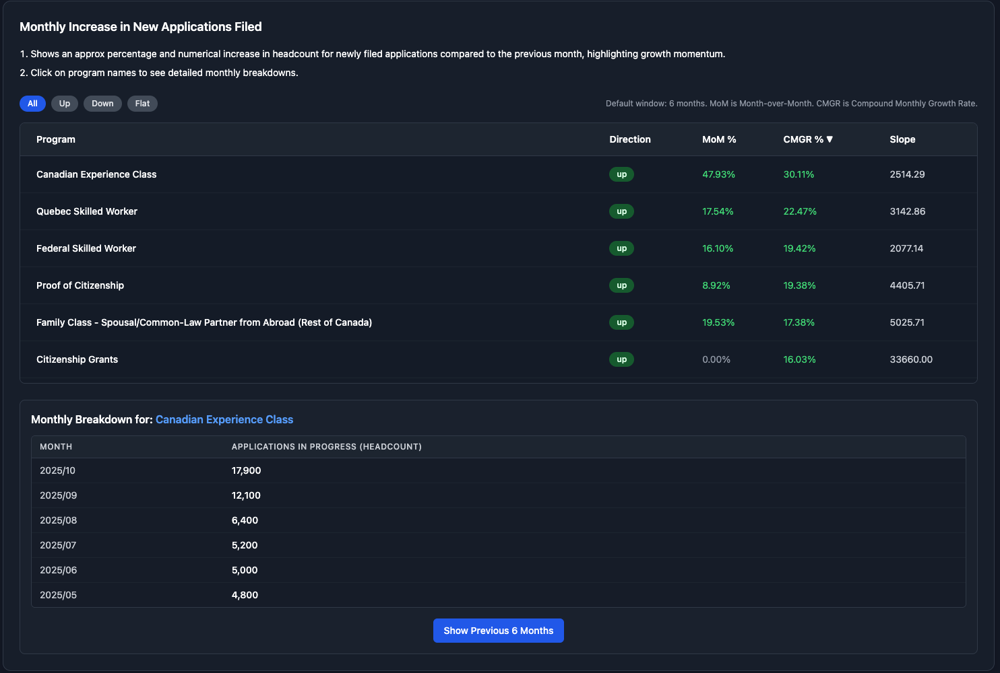

# IRCC Pulse

**Real-time analytics for IRCC application processing times.**  
Monitor trends, track wait times, and analyze application progress with a responsive dashboard.


---

## 🚀 Features

- **Realtime Tracking:** Stay updated on the number of applications and their statuses.  
- **Trend Analysis:** Visualize month-over-month and compound monthly growth rates.  
- **Wait Time Insights:** Identify programs with longer processing times.  
- **People Ahead Trends:** Analyze trends for better planning and decision-making.  

---

## 📸 Demo 

### Dashboard Overview


### Line Charts


### Trend Analysis


---

## 🛠 Tech Stack

- **React 19** – UI library  
- **TypeScript** – Type safety  
- **Vite** – Build tool for fast development  
- **@tanstack/react-query** – Data fetching and caching  
- **Recharts** – Charts and data visualization  
- **Zod** – Runtime schema validation  

---

## 📦 Installation

1. Clone the repository:

```bash
git clone https://github.com/your-username/ircc-pulse.git
cd ircc-pulse
````

2. Install dependencies:

```bash
npm install
# or
yarn install
```

3. Start the development server:

```bash
npm run dev
# or
yarn dev
```

4. Open [http://localhost:3000](http://localhost:3000) in your browser.

---

## ⚙️ Dependencies

**Runtime:**

```json
{
  "@tanstack/react-query": "^5.90.5",
  "react": "^19.2.0",
  "react-dom": "^19.2.0",
  "recharts": "^3.3.0",
  "zod": "^4.1.12"
}
```

**Development:**

```json
{
  "@types/node": "^22.14.0",
  "@vitejs/plugin-react": "^5.0.0",
  "typescript": "~5.8.2",
  "vite": "^6.2.0"
}
```

---

---

## 📝 License

MIT License © [Manoj Kumar](https://github.com/manojkrr)

---
Built with ❤️ using React, TypeScript, Vite, and TailwindCSS
